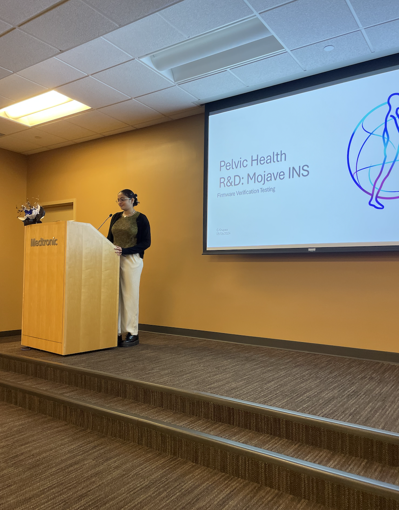
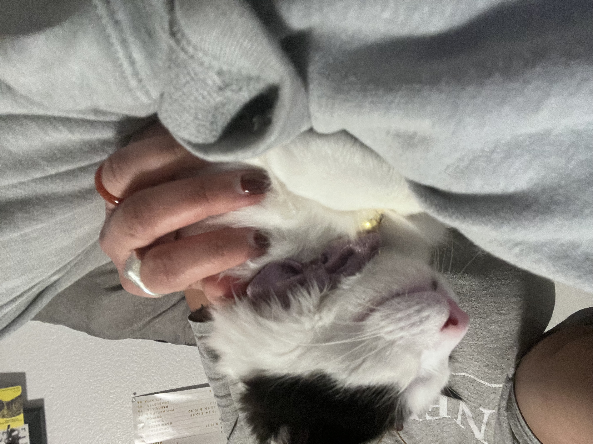

# Welcome to My GitHub! Here is a little bit about me...

Hi there! I'm **Krupaa**, a fourth-year undergraduate at the University of California, Davis, pursuing a **Bachelor of Science in Computer Science** with a minor in **Religious Studies** (Class of 2025).

### About Me
I was born and raised in Singapore before moving to the United States for college!

I am passionate about leveraging technology to solve modern-day problems, promote equity in education, and create sustainable solutions. My experiences span software development, firmware testing, machine learning, and data analysis, and I enjoy tackling challenges in these fields.

This passion was sparked during my volunteering experiences from 2018 to 2019, where I participated in an outreach program teaching English to students in Cambodia. While the work was meaningful, I realized the limitations of our efforts in creating sustainable impacts. This became a turning point for me, as I understood that technology holds the key to innovating solutions that achieve lasting change. 

I am grateful to have brought this perspective into medicine through my internships and part-time role at Medtronic, where I contribute to developing and verifying firmware for medical devices, driving meaningful advancements in healthcare.

### Interests
- **Machine Learning & Artificial Intelligence:** I am fascinated by the potential of AI in transforming industries and improving everyday life. My recent projects include building a music genre classification model and a dynamic song recommendation system.
- **Firmware Development:** My work at Medtronic has deepened my expertise in testing and verifying firmware for medical devices, particularly in Bluetooth Low Energy functionality.
- **Sustainable Technology:** I aspire to design and implement systems that are not only innovative but also environmentally friendly and socially impactful.
- **Education Equity:** Through volunteering and club initiatives, I am dedicated to making STEM education accessible to everyone.
- **Music & Arts**: Beyond academics, I love engaging with arts and creativity. Music has been a significant part of my life from a young age, and some of my favorite genres include neo-soul, indie, and hip-hop. I also studied theatre in high school and have volunteered as a guest DJ for the UC Davis radio station, blending my interests in music and storytelling. I often find the intersectionality between the arts and technology fascinating, enjoying creative approaches to solving complex problems.
- **Pets!**: I love animals. I had a dog named Oreo, a mixed breed between shiatzu and poodle. I currently have a kitten named Apple, a domestic medium hair.

### AI Projects
Here are some of the AI Projects that I have worked on:
- **Music Genre Classification and Recommendation System:** Leveraged ensemble methods like Random Forest and XGBoost to classify music genres with 84% accuracy and implemented a GPT-3.5-powered recommendation system to provide personalized song suggestions.
- **Police Dispatch Data Analysis:** Analyzed San Francisco Police Department dispatch data to optimize resource allocation and developed a predictive model to enhance policing efficiency.

### Let’s Connect!
Explore my repositories to see some of my projects, and feel free to reach out if you’d like to collaborate or discuss anything tech-related!
